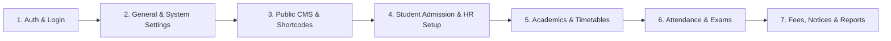

# 🎓 iSchool — Comprehensive School Management System (School ERP)

> **Empowering Education through Intelligent Automation, Modern UX, and Seamless Institutional Workflow.**
>
> **iSchool** is a full-featured, enterprise-grade School Management System built with **Next.js 16**, **TypeScript**, **Tailwind CSS v4**, **Shadcn UI**, and **Laravel 12 REST API**. It equips educational institutions with end-to-end administration tools, student information systems, academic management, automated attendance, finance collection, exam suites, and AI-powered smart terminals.

---

## 📑 Table of Contents

- [✨ Key System Features](#-key-system-features)
- [🛠 Tech Stack & Architecture](#-tech-stack--architecture)
- [🏁 Step-by-Step System Workflow & Functionality](#-step-by-step-system-workflow--functionality)
  - [1. Authentication & Role-Based Access Control](#1-authentication--role-based-access-control)
  - [2. System Settings, Branding & SMTP Email Gateway](#2-system-settings-branding--smtp-email-gateway)
  - [3. Public Website, Front CMS & Dynamic Shortcodes](#3-public-website-front-cms--dynamic-shortcodes)
  - [4. Student Information & Admission Engine](#4-student-information--admission-engine)
  - [5. Academics, Subjects & Timetables](#5-academics-subjects--timetables)
  - [6. Examination, Marks & Result Evaluation Suite](#6-examination-marks--result-evaluation-suite)
  - [7. Fees Collection & Financial Management](#7-fees-collection--financial-management)
  - [8. Human Resource (HR) & Staff Payroll](#8-human-resource-hr--staff-payroll)
  - [9. Multi-Mode & AI Smart Attendance](#9-multi-mode--ai-smart-attendance)
  - [10. Online Course & Live Virtual Classes](#10-online-course--live-virtual-classes)
  - [11. Communicate, Notices & Multi-Channel Notifications](#11-communicate-notices--multi-channel-notifications)
  - [12. Facilities: Library, Transport, Hostel & Inventory](#12-facilities-library-transport-hostel--inventory)
  - [13. Student CV & Behaviour Management](#13-student-cv--behaviour-management)
  - [14. Comprehensive Reporting & Data Export](#14-comprehensive-reporting--data-export)
- [🧩 Public CMS Shortcodes & Source Component Customization](#-public-cms-shortcodes--source-component-customization)
- [📱 Progressive Web App (PWA) & Mobile Installation](#-progressive-web-app-pwa--mobile-installation)
- [🚀 Quick Start & Installation Guide](#-quick-start--installation-guide)
- [💻 Scripts & Commands](#-scripts--commands)
- [🎨 Design System & Theme Customization](#-design-system--theme-customization)
- [📄 License & Credits](#-license--credits)

---

## ✨ Key System Features

* **Progressive Web App (PWA) Support**: 1-click installable native mobile & desktop application with dynamic icons, app shortcuts, offline service worker caching, and standalone window mode.
* **Dynamic Public CMS & Shortcode Engine**: Single route handler (`src/app/[slug]/page.tsx`) that renders any dynamic page from `/dashboard/front-cms/pages`, executing embedded HTML/scripts and processing shortcodes.
* **37+ Specialized Dashboard Modules**: Comprehensive administrative coverage spanning every department of a modern educational institution.
* **Intelligent Examination Results Lookup**: Public portal for students to search marks by Roll Number, view detailed subject marks, detect unpublished status, and print marksheet summaries.
* **Smart Contact Form with Anti-Bot Captcha**: 2-column contact layout with mathematical captcha verification, dynamic school branding, and automatic forwarding to the configured Receiver Email via system SMTP.
* **Smart AI & Biometric Attendance**: Support for Day-wise, Period-wise, QR-Code Scanner, and `face-api.js` Face Recognition terminals.
* **Dual Examination Suite**: End-to-end support for traditional exams, CBSE report card templates, and Online Examinations with Question Banks.
* **Integrated Online Learning**: Dedicated modules for course creation, video enrollment, Google Meet, and Zoom Live Classes.
* **Granular Branding & Theme Customization**: Custom school logo, print logo, admin logo, small admin logo, background images, HSL primary colors, light/dark modes, and skin variants (`shadow` / `bordered`).
* **Multi-Format Data Export**: Standardized single-click Export toolbars for **Excel (.xlsx)**, **PDF (.pdf)**, **CSV (.csv)**, and **Direct Printing** across all tables.

---

## 🛠 Tech Stack & Architecture

### **Frontend Framework**
- **Next.js 16** (App Router, Dynamic Slug Catch-all, Server External Packages)
- **React 19** (Hooks, Context Providers, Component Architecture)
- **TypeScript 5** (Strict Type Safety & Interface Definitions)

### **Styling & UI Components**
- **Tailwind CSS v4** (`@import "tailwindcss"` with custom PostCSS setup)
- **Shadcn UI** (Radix UI Accessible Primitives)
- **Lucide React** (Modern SVG Vector Iconography)
- **Framer Motion** (Smooth Micro-Animations & Page Transitions)

### **Backend Integration & APIs**
- **Laravel 12 API** (Sanctum Token Authentication via HTTP Bearer Header)
- **EmailGatewayManager** (Dynamic SMTP gateway configuration with Round-Robin load balancing)
- **Axios Interceptor** (Centralized API handling with automatic 401 redirect)
- **MSW (Mock Service Worker)** (Seamless fallback for auth & system settings in development)

### **Key Utility Libraries**
- **Spreadsheets & PDF**: `xlsx`, `papaparse`, `jspdf`, `jspdf-autotable`
- **Charts & Data Visualization**: `recharts`
- **AI & Scanning**: `face-api.js`, `jsqr`, `qrcode`, `html2canvas`
- **Drag and Drop**: `@hello-pangea/dnd`
- **Rich Text & Pickers**: `react-quill-new`, `react-day-picker`

---

## 🏁 Step-by-Step System Workflow & Functionality



### 1. Authentication & Role-Based Access Control
1. **Multi-Role Login**: Switch between **Admin Login** and **Student/Parent** login panels.
2. **Quick Demo Shortcuts**: Instant credential fill for **Super Admin**, **Admin**, **Teacher**, **Accountant**, **Receptionist**, **Librarian**, **Student**, and **Parent**.
3. **Captcha Security**: Dynamic mathematical captcha verification for enhanced brute-force protection.
4. **Session Persistence**: Automatic Sanctum Bearer token storage in `localStorage` with auto-route redirection by role (`/dashboard` vs `/user/dashboard`).

### 2. System Settings, Branding & SMTP Email Gateway
1. **General Settings**: Configure school name, slogan, description, address, contact info, session start month, timezone, and date/time formats.
2. **Logo Management**: Upload and manage high-res **Print Logo** (for invoice receipts), **Admin Logo**, **Admin Small Logo**, and **App Logo**.
3. **Contact Form Receiver Email**: Configure `contact_form_receiver_email` under General Setting Tab &rarr; Contact Form section. All inquiries from the public contact form forward to this destination.
4. **SMTP Email Gateway Manager**: Dynamic SMTP gateway provider supporting Single Gateway, Custom Credentials, and Round-Robin load balancing with daily limits.
5. **Backend Theme & Skins**: Switch theme modes (Light/Dark), Primary Accent Colors (Indigo, Blue, Amber, Emerald, Red), Sidebar States (Expanded/Collapsed), and Container Skins (`shadow`/`bordered`).

### 3. Public Website, Front CMS & Dynamic Shortcodes
1. **Dynamic Slug Router (`src/app/[slug]/page.tsx`)**: All pages created in `/dashboard/front-cms/pages` via **Add Page** render dynamically without requiring hardcoded route files.
2. **Raw HTML & Script Execution**: If an admin writes or pastes custom raw HTML, the engine renders it natively and dynamically executes embedded `<script>` and `<style>` elements.
3. **Built-in Public Pages**:
   - `/home`: Landing page with hero banner, statistics, feature highlights, and course previews.
   - `/about-us`: Rich institution profile, history, mission, vision, values, and educational pillars.
   - `/academics`: Comprehensive curriculum details, principal message, uniforms, school facilities, sports day, and student council.
   - `/exam-results`: Public student examination marksheet lookup by Roll Number.
   - `/notices`: Public notice board with keyword search, audience filtering, and full notice reader modals.
   - `/contact-us`: 2-column contact section with dynamic captcha, school information, logos, and social media links.
   - `/online_admission`: Public online student registration portal with form fees and customizable fields.

### 4. Student Information & Admission Engine
1. **Student Admission**: Multi-step student registration with auto-generated Admission Numbers, document uploads, guardian details, and fee structure assignment.
2. **Student Directory**: Searchable, filterable directory with class, section, and keyword filters.
3. **Student History & Details**: Deep-dive profile pages with academic history, attendance record, discipline log, timeline, and fee status.
4. **Categorization & Houses**: Organize students by Student Houses (e.g., Red, Blue, Green), Categories (General, OBC, SC/ST), and Disable Reasons.

### 5. Academics, Subjects & Timetables
1. **Class & Section Management**: Define academic classes (e.g., Class 1 to Class 12) and section splits (A, B, C).
2. **Subject Allocation**: Assign Theory/Practical subjects and assign designated subject teachers per section.
3. **Timetable Builder**: Construct drag-and-drop weekly class schedules and individual teacher timetables.
4. **Assign Class Teachers**: Delegate supervisory class teachers to sections.

### 6. Examination, Marks & Result Evaluation Suite
1. **Exam Groups & Schedules**: Group exams by term (e.g., Mid-Term, Annual) and set start/end times, room allocations, and passing marks.
2. **Marks Entry**: Batch mark entry for teachers per subject with theory and practical scores and auto-grade calculation.
3. **Publish Results Workflow**: Toggle `is_result_published` per exam. When unpublished, the public portal displays `"Result Not published Yet."`
4. **CBSE Examination Suite**: Dedicated CBSE term assessment, co-scholastic observations, and automated CBSE-compliant report card generator.
5. **Online Examinations**: Create timed online exams, build reusable Question Banks, and publish auto-graded results to student portals.
6. **Admit Cards & Marksheets**: Customizable admit cards and marksheet templates with printable outputs.

### 7. Fees Collection & Financial Management
1. **Collect Fees**: Search student accounts, view pending dues, apply discounts, and collect payments (Cash, Cheque, Bank Transfer, Online Gateway).
2. **Fees Setup**: Create Fee Groups, Fee Masters, Fee Types, and Fee Discounts (e.g., Merit Scholarship, Sibling Discount).
3. **Thermal Receipt Printing**: Generate single-page compact thermal receipts for Office Copy, Student Copy, and Bank Copy.
4. **Income & Expense Tracking**: Categorize institutional incomes/expenses with invoice auto-generation and financial ledger logs.

### 8. Human Resource (HR) & Staff Payroll
1. **Staff Directory**: Centralized repository for teaching and non-teaching staff with role assignment.
2. **Staff Attendance**: Daily staff attendance logging with present, late, half-day, and absent classifications.
3. **Payroll Processing**: Automated monthly salary computation based on base pay, earnings, deductions, and tax rules.
4. **Leave Management**: Staff leave applications, approval workflows, leave type configuration, and dynamic leave calendar widgets.

### 9. Multi-Mode & AI Smart Attendance
1. **Day-wise & Period-wise Attendance**: Mark class attendance daily or period-by-period with bulk toggle buttons.
2. **QR-Code Scanner Terminal**: Built-in webcam scanner for instant student/staff ID badge scanning (`jsqr`).
3. **Smart Face Recognition**: Real-time AI face recognition terminal powered by `face-api.js` for hands-free biometric attendance marking.

### 10. Online Course & Live Virtual Classes
1. **Online Course Platform**: Teachers create video courses, upload lesson chapters, and assign quizzes.
2. **Gmeet & Zoom Live Classes**: Schedule virtual live classes, generate instant join links, and track student live attendance duration.

### 11. Communicate, Notices & Multi-Channel Notifications
1. **Notice Board**: Post school-wide notices, target specific roles (Teachers, Students, Parents), and pin urgent announcements.
2. **Send Credentials**: One-click bulk login credential dispatcher via Email, SMS, or WhatsApp.
3. **Message Templates**: Customizable templates for fees reminders, exam schedules, and holiday announcements.

### 12. Facilities: Library, Transport, Hostel & Inventory
1. **Library Management**: Catalog books, track ISBNs, issue books to students/staff, and calculate overdue fines.
2. **Transport**: Manage vehicle fleets, driver profiles, route stops, and assign transport fees per route.
3. **Hostel**: Configure hostels, room types, bed capacities, and allocate rooms to resident students.
4. **Inventory**: Stock management, item store allocation, supplier tracking, and item issuance.

### 13. Student CV & Behaviour Management
1. **Student CV Generator**: Auto-generate professional student resumes/CVs highlighting academic records and extracurricular achievements.
2. **Behaviour Records**: Log student merit points and disciplinary incidents with review workflows.

### 14. Comprehensive Reporting & Data Export
1. **Departmental Reports**: 30+ built-in reports covering Finance, Attendance, Audit Trail, Homework, Library, Transport, and User Logs.
2. **Universal Export Toolbar**: Every table includes instant **Copy**, **Excel (.xlsx)**, **PDF (.pdf)**, and **Print** buttons.

---

## 🧩 Public CMS Shortcodes & Source Component Customization

When creating or editing pages in **/dashboard/front-cms/pages**, you can insert shortcodes into the page content. The system parses and replaces them with rich, interactive components.

If you want to modify what a shortcode generates (e.g. change icons, form fields, badges, or layout), edit the corresponding source component file:

| Shortcode | Purpose / Output | Source Component to Edit |
| :--- | :--- | :--- |
| **`[contact_form]`** | 2-Column Contact Form, Math Captcha, School Logo, Admin Small Logo, Contact Details, Social Media Links & Email Forwarding | [`src/components/public/contact-form.tsx`](file:///k:/flyenv_folder/iSchool/src/components/public/contact-form.tsx) |
| **`[about_us]`** *(or `[about]`)* | School Overview, 25+ Years Experience Badge, Mission/Vision/Values Cards, Statistics Strip, Advantages Grid & Educational Pillars Accordion | [`src/components/public/about-section.tsx`](file:///k:/flyenv_folder/iSchool/src/components/public/about-section.tsx) |
| **`[exam_result]`** | Student Roll Number Search, Examination Dropdown, "Result Not published Yet" Banner, Subject Marksheet Table & Print Action | [`src/components/public/exam-result-section.tsx`](file:///k:/flyenv_folder/iSchool/src/components/public/exam-result-section.tsx) |
| **`[notice_board]`** | Searchable Notice Board with Category Filter Tabs (Students, Guardians, Staff), Notice Cards & Full Reader Modal with Print | [`src/components/public/notice-board-section.tsx`](file:///k:/flyenv_folder/iSchool/src/components/public/notice-board-section.tsx) |

> **Note**: You can also mix raw HTML with shortcodes, or completely replace a shortcode with custom HTML. The dynamic renderer will safely render and execute your HTML and scripts.

---

## 📱 Progressive Web App (PWA) & Mobile Installation

iSchool provides full **Progressive Web App (PWA)** capabilities, allowing the entire application to be installed as a native app on **Android**, **iOS (Safari Add to Home Screen)**, **Windows**, **macOS**, and **ChromeOS**.

### PWA Capabilities & Architectural Highlights
1. **Zero-App-Store Installation**: Users can install the school application directly from their web browser with a single tap/click via the smart in-app install prompt.
2. **Dynamic Manifest (`/manifest.json` & `src/app/manifest.ts`)**: The Web App Manifest dynamically synchronizes with General Settings:
   - **App Name & Short Name**: Reads custom `pwa_app_short_name` (PWA App Short Name field) configured under General Setting / Logo.
   - **App Description**: Reads custom `pwa_app_description` (PWA App Description).
   - **Dynamic Icons**: Dedicated PWA icons (`pwa_icon_512`, `pwa_icon_192`, and `pwa_icon_maskable`) separate from the standard browser favicon.
   - **App Theme Color & Background**: Synchronized with institutional primary colors (`#6366F1`) and background modes.
3. **App Quick Shortcuts**: Native app shortcuts available on long-press or desktop right-click:
   - 🎓 **Student Portal**: Direct launch to `/user/dashboard`.
   - 🏫 **Admin Portal**: Direct launch to `/dashboard`.
4. **Service Worker (`public/sw.js`)**: Offline asset caching, fast boot times, and background sync support.
5. **Standalone Native Mode**: Launches without browser address bars or navigation chrome, providing a full native desktop and mobile app experience.

---

## 🚀 Quick Start & Installation Guide

### Prerequisites
- **Node.js**: v18.0.0 or higher
- **Package Manager**: `npm` (configured with `legacy-peer-deps=true` in `.npmrc`)
- **Backend Service**: PHP 8.2+ with Laravel 12 & MySQL database

### 1. Clone Repository
```bash
git clone https://github.com/iamdoulat/ischool_template.git
cd ischool_template
```

### 2. Install Dependencies
```bash
npm install
```

### 3. Start Development Server
```bash
npm run dev
```
Open your browser and navigate to `http://localhost:3000`.

---

## 💻 Scripts & Commands

| Command | Description |
| :--- | :--- |
| `npm run dev` | Starts Next.js development server using Webpack compiler (`next dev --webpack`) |
| `npm run build` | Builds optimized production bundle (`next build`) |
| `npm run start` | Launches Next.js production server (`next start`) |
| `npm run lint` | Runs ESLint for code quality and style validation |

---

## 🎨 Design System & Theme Customization

iSchool uses **Tailwind CSS v4** and CSS variable design tokens defined in `src/app/globals.css`.

- **Primary Accent**: Indigo `#6366F1`
- **Secondary Gradient Buttons**: `bg-gradient-to-r from-[#FF9800] to-[#6366F1]` (Orange to Indigo)
- **Dark Mode**: Fully supported dark background palette (`bg-slate-900` / `bg-slate-800`) with backdrop blur glassmorphism (`backdrop-blur-xl`).
- **Typography**: Clean, accessible sans-serif font stack (`Plus Jakarta Sans`).

---

## 📄 License & Credits

Distributed under the **MIT License**.

Designed and developed with ❤️ for modern educational institutions.
